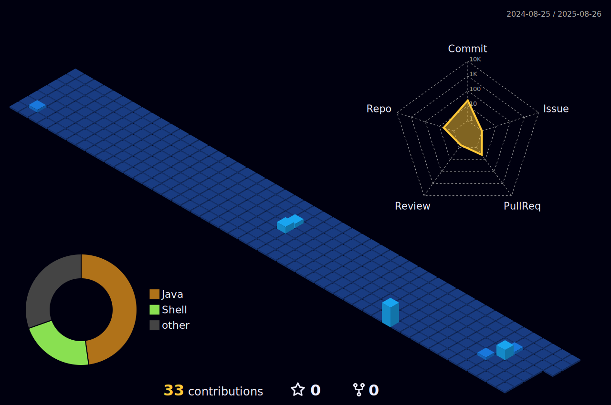

<h1 align="center">
  WORA SOUAMY Louis Martin
</h1>

  

<!-- Proudly created with GPRM ( https://gprm.itsvg.in ) -->

  
  
   
   

# 💻 Tech Stack:
                        

# 📊 GitHub Stats:
 

## 🏆 GitHub Trophies

### ✍️ Random Dev Quote

### 🔝 Top Contributed Repo

### 😂 Random Dev Meme

### 🆕 Latest YouTube Videos
<!-- BEGIN YOUTUBE-CARDS -->

<!-- END YOUTUBE-CARDS -->

